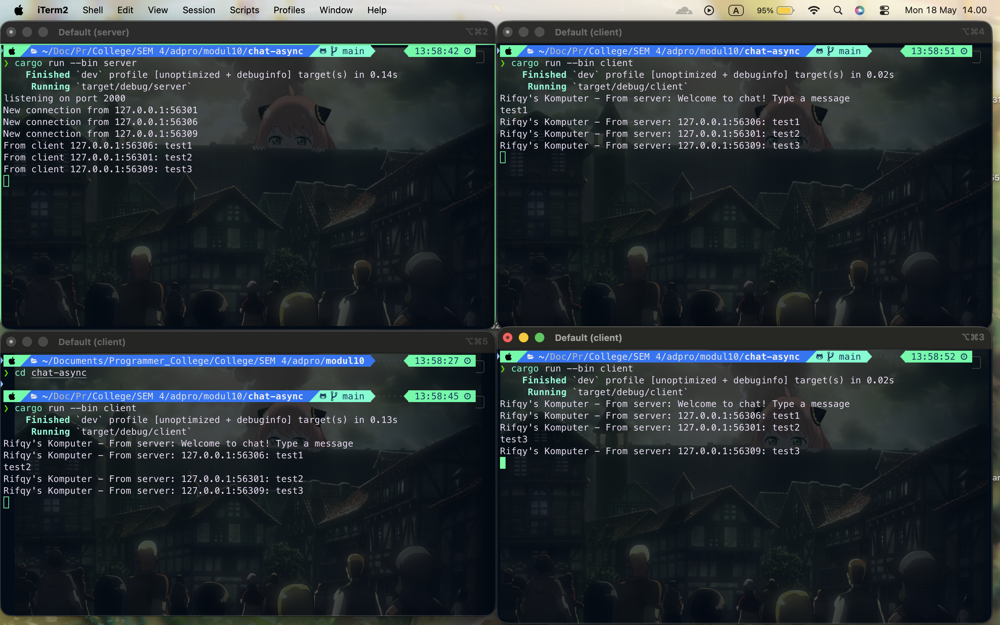
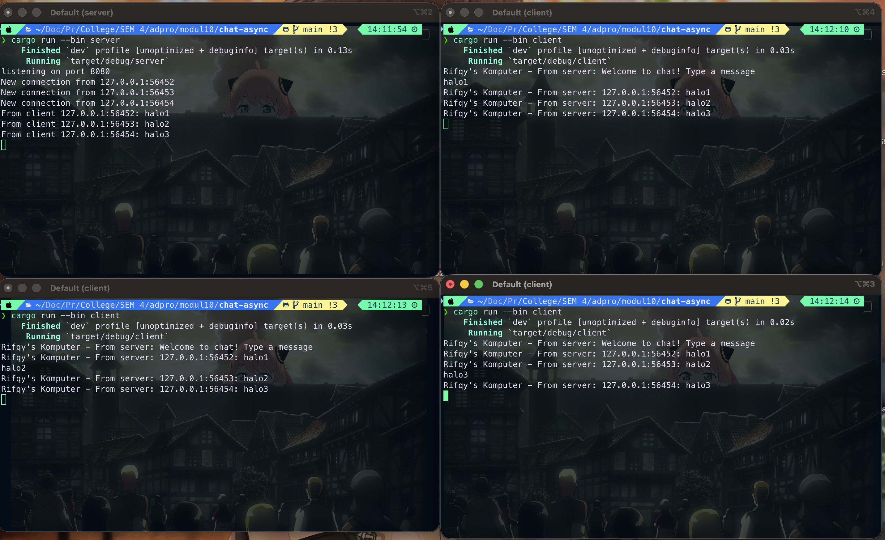

# Reflection

## Original Code and How It Runs

Untuk menjalankan server dan klien, saya melakukan langkah berikut:

1. Buka 4 terminal terpisah.
2. Masuk ke direktori proyek `chat-async` pada semua terminal.
3. Pada terminal pertama, jalankan server:
   - `cargo run --bin server`
4. Pada tiga terminal lain, jalankan klien:
   - `cargo run --bin client`

Setelah semua klien terhubung, ketika salah satu klien mengetik pesan, pesan tersebut akan dikirim ke server melalui websocket. Server kemudian melakukan broadcast ke channel bersama dan semua klien yang subscribe channel tersebut akan menerima pesan yang sama. Karena itu, satu pesan dari satu klien akan tampil di seluruh klien yang aktif.

## Modifying Port

Untuk mengubah port pada server, saya perlu mengubah nomor port `TCPListener` di file `server.rs`. Saya juga perlu mengubah nomor port di file `client.rs` agar sesuai dengan nomor port server.

Protokol websocket pada sisi server sendiri tidak dinyatakan secara eksplisit. Pada kode server, port di-`bind` ke `TCPListener` yang menugaskan sebuah proses untuk mendengarkan koneksi TCP yang melewati port tersebut. Setelah koneksi dibuat, server kemudian membuat socket yang kemudian diberikan ke websocket handler.

Jadi, server tidak sepenuhnya mendeklarasikan protokol websocket tersebut secara eksplisit, tetapi mengimplementasikan spesifikasi protokol websocket melalui crate `tokio-websockets`. Selain itu, pada sisi client protokol websocket didefinisikan di URI melalui prefix `ws://...`.
